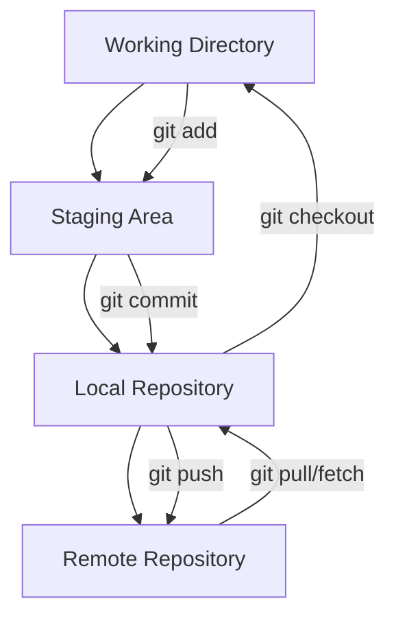
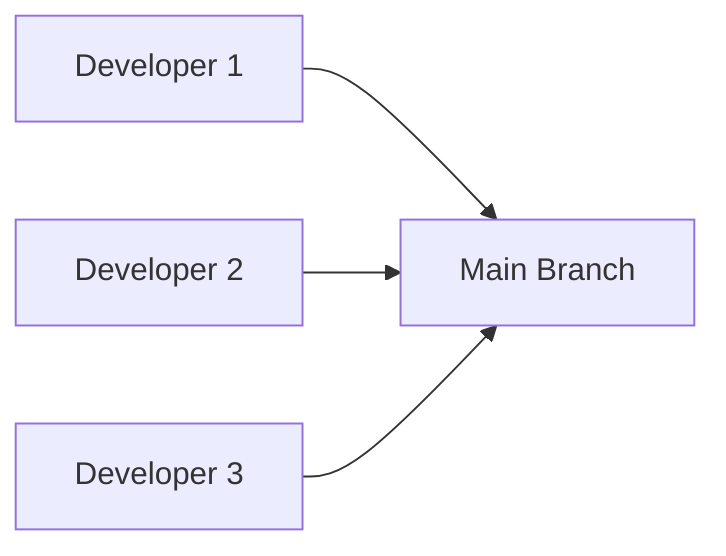
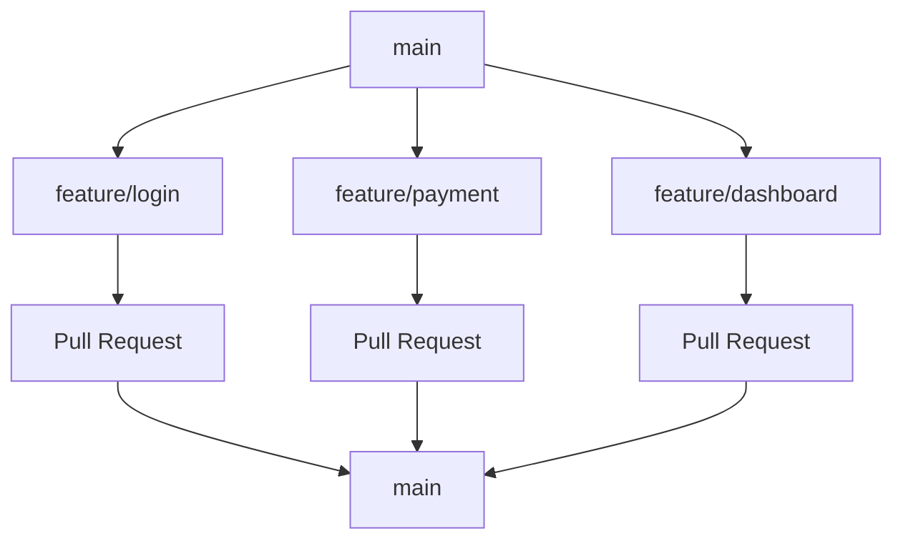
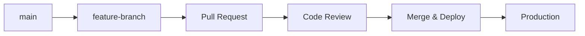
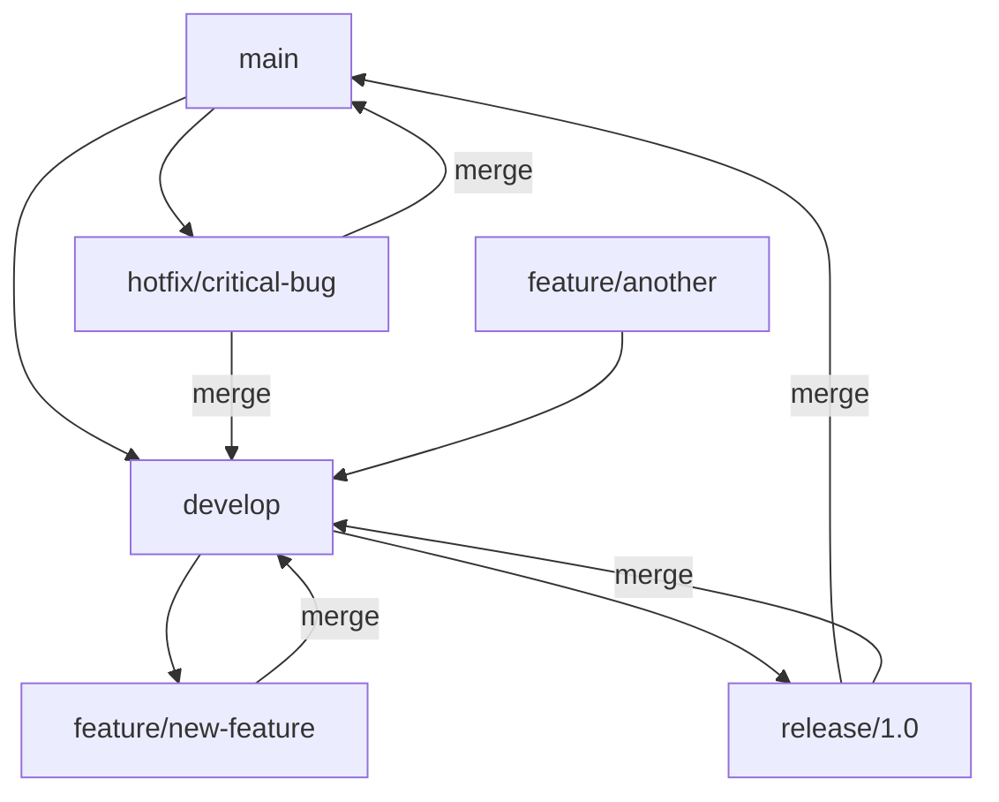
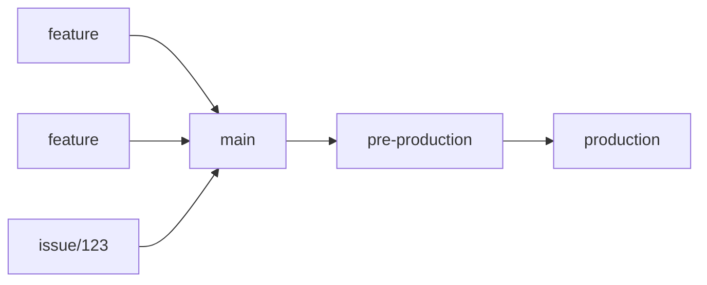
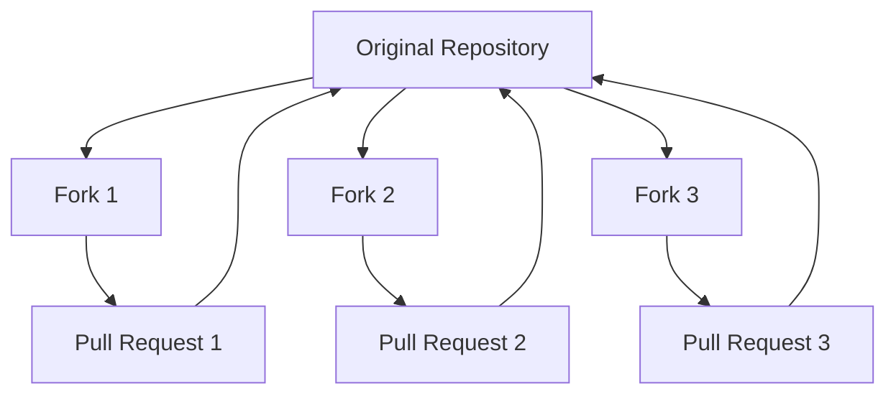
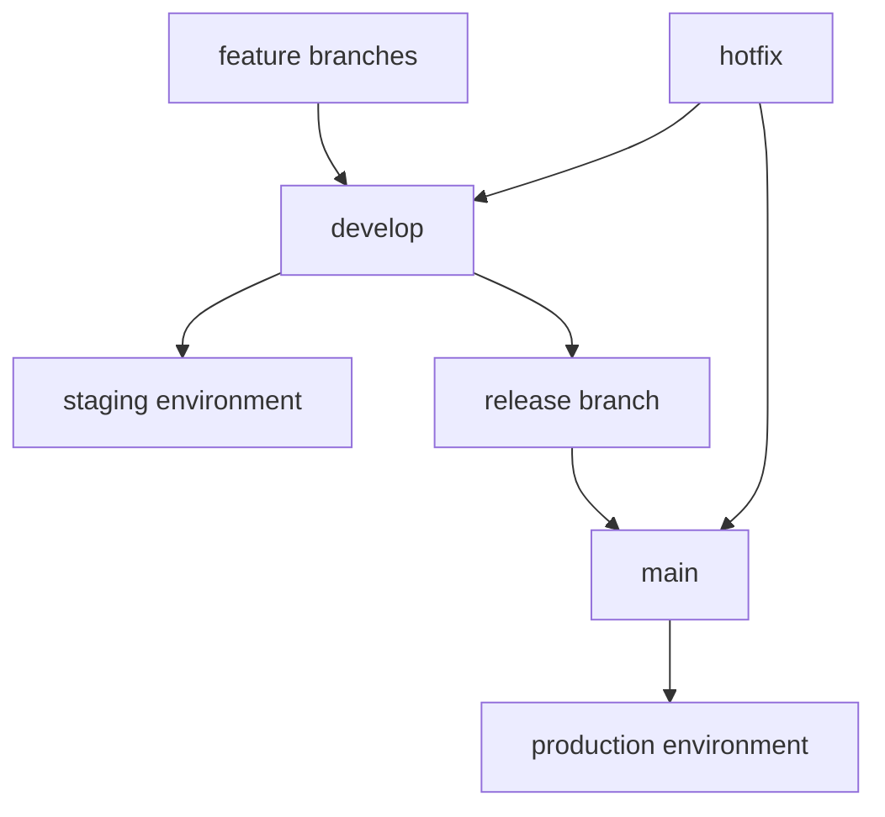

# Git and Git Flow in DevOps

## Table of Contents
1. [Git Fundamentals](#1-git-fundamentals)
2. [Common Git Workflows](#2-common-git-workflows)
3. [Git Flow in DevOps](#3-git-flow-in-devops)
4. [Best Practices](#4-best-practices)
5. [Advanced Git Techniques](#5-advanced-git-techniques)
6. [Troubleshooting](#6-troubleshooting)

## 1. Git Fundamentals

### 1.1. What is Git?
Git is a distributed version control system that tracks changes in source code during software development. It's designed for coordinating work among programmers, but it can be used to track changes in any set of files.

### 1.2. Basic Git Commands

#### Repository Initialization
```bash
# Initialize a new Git repository
git init

# Clone an existing repository
git clone <repository-url>
git clone https://github.com/user/repo.git
```

#### Basic Operations
```bash
# Check repository status
git status

# Add files to staging area
git add <file-name>
git add .                    # Add all files
git add *.js                 # Add all JavaScript files

# Commit changes
git commit -m "Commit message"
git commit -am "Add and commit in one step"

# View commit history
git log
git log --oneline           # Compact view
git log --graph --oneline   # Graph view
```

#### Branch Operations
```bash
# List branches
git branch                  # Local branches
git branch -r              # Remote branches
git branch -a              # All branches

# Create and switch branches
git branch <branch-name>
git checkout <branch-name>
git checkout -b <branch-name>  # Create and switch

# Modern syntax (Git 2.23+)
git switch <branch-name>
git switch -c <branch-name>    # Create and switch

# Delete branches
git branch -d <branch-name>    # Safe delete
git branch -D <branch-name>    # Force delete
```

#### Remote Operations
```bash
# Add remote repository
git remote add origin <repository-url>

# Push changes
git push origin <branch-name>
git push -u origin <branch-name>  # Set upstream

# Pull changes
git pull origin <branch-name>
git fetch origin               # Fetch without merge

# View remotes
git remote -v
```

### 1.3. Git Architecture



## 2. Common Git Workflows

### 2.1. Workflow Overview and Comparison

Git workflows define how teams collaborate and manage code changes. The choice depends on team size, release frequency, and deployment strategy.

#### Workflow Comparison Table:
| Workflow | Complexity | Team Size | Release Frequency | CI/CD | Best For |
|----------|------------|-----------|-------------------|-------|----------|
| Centralized | Low | 1-3 | Any | Basic | Small projects, learning |
| Feature Branch | Medium | 3-10 | Weekly/Monthly | Good | Most teams |
| Git Flow | High | 5+ | Monthly/Quarterly | Advanced | Scheduled releases |
| GitHub Flow | Low | Any | Daily | Excellent | Continuous deployment |
| GitLab Flow | Medium | 3-15 | Weekly | Excellent | Issue-driven development |
| Forking | Medium | Open source | Any | Good | Open source projects |

### 2.2. Centralized Workflow
**Best for:** Small teams, simple projects, beginners

The simplest workflow where all developers work directly on the main branch.



#### Implementation:
```bash
# Work directly on main
git clone <repo-url>
git add .
git commit -m "Make changes"
git pull origin main    # Get latest changes
git push origin main    # Push your changes
```

#### Pros & Cons:
✅ **Pros:**
- Simple and easy to understand
- No branch management overhead
- Quick for small changes

❌ **Cons:**
- High risk of conflicts
- No feature isolation
- Difficult to manage releases
- No code review process

### 2.3. Feature Branch Workflow
**Best for:** Most development teams, standard projects

Each feature is developed in a dedicated branch, merged via Pull/Merge Requests.



#### Implementation:
```bash
# Create feature branch
git checkout -b feature/user-authentication

# Work on feature
git add .
git commit -m "Add user authentication"
git push origin feature/user-authentication

# Create Pull Request via UI
# After review and approval:
git checkout main
git pull origin main
git branch -d feature/user-authentication
```

#### Pros & Cons:
✅ **Pros:**
- Feature isolation
- Code review process
- Clean main branch
- Easy rollback

❌ **Cons:**
- Requires pull request workflow
- Can have long-lived branches
- Merge conflicts possible

### 2.4. GitHub Flow
**Best for:** Continuous deployment, web applications, agile teams

Simplified workflow optimized for frequent deployments.



#### GitHub Flow Process:
1. **Branch:** Create branch from main
2. **Commit:** Make changes and commit
3. **Pull Request:** Open PR for discussion
4. **Review:** Code review and testing
5. **Merge:** Merge to main
6. **Deploy:** Immediate deployment

#### Implementation:
```bash
# Create feature branch
git checkout -b improve-user-interface

# Make changes
git add .
git commit -m "Improve user interface design"
git push origin improve-user-interface

# Create Pull Request via GitHub UI
# After merge, automatic deployment triggers
```

#### Pros & Cons:
✅ **Pros:**
- Simple and fast
- Continuous deployment ready
- Always deployable main
- Short-lived branches

❌ **Cons:**
- Requires robust CI/CD
- No release preparation
- Less control over releases

### 2.5. Git Flow
**Best for:** Scheduled releases, complex projects, formal release process

Robust branching model with dedicated branches for different purposes.



#### Branch Types:
- **main/master:** Production-ready code
- **develop:** Integration branch for features
- **feature/*:** New feature development
- **release/*:** Prepare new production releases
- **hotfix/*:** Critical production fixes

#### Git Flow Commands:
```bash
# Initialize git flow
git flow init

# Feature development
git flow feature start new-feature
# ... make changes ...
git flow feature finish new-feature

# Release management
git flow release start 1.0.0
# ... final testing and bug fixes ...
git flow release finish 1.0.0

# Hotfix
git flow hotfix start critical-fix
# ... fix the issue ...
git flow hotfix finish critical-fix
```

#### Pros & Cons:
✅ **Pros:**
- Clear separation of concerns
- Supports scheduled releases
- Parallel development
- Hotfix capability

❌ **Cons:**
- Complex branch management
- Overhead for simple projects
- Not suitable for continuous deployment

### 2.6. GitLab Flow
**Best for:** Issue-driven development, environment-based deployments

Combines feature-driven development with environment branches and issue tracking.



#### GitLab Flow Variants:

**Environment Branches:**
```bash
# Feature development
git checkout -b feature/new-api
# ... develop feature ...
git push origin feature/new-api
# Create Merge Request to main

# Deploy to environments
git checkout pre-production
git merge main              # Deploy to staging
git checkout production  
git merge pre-production    # Deploy to production
```

**Issue-driven Development:**
```bash
# Create branch from issue
git checkout -b issue/123-fix-login-bug
# ... fix the issue ...
git push origin issue/123-fix-login-bug
# Create Merge Request that closes issue #123
```

#### Pros & Cons:
✅ **Pros:**
- Issue tracking integration
- Environment-based deployment
- Flexible approach
- Good for CI/CD

❌ **Cons:**
- Can become complex
- Requires discipline
- Multiple merge points

### 2.7. Forking Workflow
**Best for:** Open source projects, large teams, external contributors

Contributors fork the repository and submit changes via pull requests.



#### Implementation:
```bash
# Fork repository via UI
# Clone your fork
git clone https://github.com/yourusername/project.git

# Add upstream remote
git remote add upstream https://github.com/original/project.git

# Create feature branch
git checkout -b new-feature

# Make changes and push to your fork
git push origin new-feature

# Create Pull Request to original repository
```

### 2.8. Choosing the Right Workflow

#### Decision Matrix:

**Team Size:**
- **1-3 developers:** Centralized or GitHub Flow
- **3-10 developers:** Feature Branch or GitHub Flow
- **10+ developers:** Git Flow or GitLab Flow
- **Open source:** Forking Workflow

**Release Strategy:**
- **Continuous deployment:** GitHub Flow
- **Weekly releases:** Feature Branch or GitLab Flow
- **Monthly/Quarterly:** Git Flow
- **Ad-hoc releases:** Centralized

**Project Complexity:**
- **Simple projects:** Centralized or GitHub Flow
- **Medium complexity:** Feature Branch or GitHub Flow
- **Complex projects:** Git Flow or GitLab Flow

#### Migration Path:
```
Centralized → Feature Branch → GitHub Flow → GitLab Flow
                                ↓
                            Git Flow
```

## 3. Git Flow in DevOps

### 3.1. Integration with CI/CD

#### Branch-based CI/CD Strategy:
```yaml
# .github/workflows/ci-cd.yml
name: CI/CD Pipeline

on:
  push:
    branches: [ main, develop ]
  pull_request:
    branches: [ main ]

jobs:
  test:
    runs-on: ubuntu-latest
    if: github.event_name == 'pull_request'
    steps:
      - uses: actions/checkout@v3
      - name: Run tests
        run: npm test

  deploy-staging:
    runs-on: ubuntu-latest
    if: github.ref == 'refs/heads/develop'
    steps:
      - uses: actions/checkout@v3
      - name: Deploy to staging
        run: ./scripts/deploy-staging.sh

  deploy-production:
    runs-on: ubuntu-latest
    if: github.ref == 'refs/heads/main'
    steps:
      - uses: actions/checkout@v3
      - name: Deploy to production
        run: ./scripts/deploy-production.sh
```

### 3.2. Environment-based Git Flow



#### Environment Mapping:
- **feature branches** → **development environment**
- **develop branch** → **staging environment**  
- **release branches** → **pre-production environment**
- **main branch** → **production environment**

### 3.3. Semantic Versioning with Git Tags

```bash
# Create annotated tags for releases
git tag -a v1.0.0 -m "Release version 1.0.0"
git push origin v1.0.0

# List tags
git tag -l

# Checkout specific version
git checkout v1.0.0

# Create release from tag
git flow release start $(git describe --tags --abbrev=0)
```

### 3.4. Automated Release Management

#### Conventional Commits:
```bash
# Feature commits
git commit -m "feat: add user authentication"

# Bug fix commits  
git commit -m "fix: resolve login issue"

# Breaking changes
git commit -m "feat!: change API structure"

# Documentation
git commit -m "docs: update README"
```

#### Automated Changelog Generation:
```json
{
  "scripts": {
    "changelog": "conventional-changelog -p angular -i CHANGELOG.md -s",
    "release": "standard-version"
  }
}
```

### 3.5. Multi-Repository Management

#### Git Submodules:
```bash
# Add submodule
git submodule add https://github.com/user/library.git libs/library

# Initialize submodules
git submodule init
git submodule update

# Update submodules
git submodule update --remote
```

#### Monorepo with Git:
```bash
# Directory structure
project/
├── services/
│   ├── api/
│   ├── frontend/
│   └── worker/
├── shared/
│   ├── utils/
│   └── types/
└── deploy/
```

## 4. Best Practices

### 4.1. Commit Message Guidelines

#### Format:
```
<type>(<scope>): <subject>

<body>

<footer>
```

#### Examples:
```bash
feat(auth): add JWT token validation

Implement JWT token validation middleware
- Add token verification logic
- Handle expired tokens
- Add error handling

Closes #123
```

### 4.2. Branch Naming Conventions

```bash
# Feature branches
feature/user-authentication
feature/payment-integration
feat/JIRA-123-user-profile

# Bug fix branches
bugfix/login-error
fix/payment-validation
hotfix/critical-security-patch

# Release branches
release/v1.2.0
release/2023-q1

# Environment branches
develop
staging
main/master
```

### 4.3. Code Review Process

#### Pull Request Template:
```markdown
## Description
Brief description of changes

## Type of Change
- [ ] Bug fix
- [ ] New feature
- [ ] Breaking change
- [ ] Documentation update

## Testing
- [ ] Unit tests pass
- [ ] Integration tests pass
- [ ] Manual testing completed

## Checklist
- [ ] Code follows style guidelines
- [ ] Self-review completed
- [ ] Documentation updated
```

### 4.4. Security Best Practices

```bash
# Use SSH keys
ssh-keygen -t ed25519 -C "your_email@example.com"

# Configure Git with signing
git config --global user.signingkey <key-id>
git config --global commit.gpgsign true

# Signed commits
git commit -S -m "Signed commit message"
```

## 5. Advanced Git Techniques

### 5.1. Interactive Rebase

```bash
# Interactive rebase last 3 commits
git rebase -i HEAD~3

# Rebase onto another branch
git rebase -i develop

# Common rebase actions:
# pick - use commit as is
# reword - edit commit message
# edit - stop for amending
# squash - combine with previous commit
# drop - remove commit
```

### 5.2. Git Hooks for DevOps

#### Pre-commit Hook:
```bash
#!/bin/sh
# .git/hooks/pre-commit

# Run tests before commit
npm test
if [ $? -ne 0 ]; then
    echo "Tests failed, commit aborted"
    exit 1
fi

# Check code formatting
npm run lint
if [ $? -ne 0 ]; then
    echo "Linting failed, commit aborted"
    exit 1
fi
```

#### Post-receive Hook (Server-side):
```bash
#!/bin/sh
# Trigger deployment on push to main

while read oldrev newrev refname; do
    if [ "$refname" = "refs/heads/main" ]; then
        echo "Deploying to production..."
        /path/to/deploy-script.sh
    fi
done
```

### 5.3. Git Bisect for Debugging

```bash
# Start bisecting
git bisect start

# Mark current commit as bad
git bisect bad

# Mark known good commit
git bisect good v1.0.0

# Git will check out commits for testing
# Mark each commit as good or bad
git bisect good    # Current commit is good
git bisect bad     # Current commit is bad

# Reset after finding the problematic commit
git bisect reset
```

### 5.4. Cherry-picking

```bash
# Apply specific commit to current branch
git cherry-pick <commit-hash>

# Cherry-pick range of commits
git cherry-pick A..B

# Cherry-pick without committing
git cherry-pick -n <commit-hash>
```

## 6. Troubleshooting

### 6.1. Common Issues and Solutions

#### Merge Conflicts:
```bash
# View conflict status
git status

# Resolve conflicts manually in files, then:
git add <resolved-file>
git commit

# Abort merge if needed
git merge --abort
```

#### Undoing Changes:
```bash
# Undo last commit (keep changes)
git reset --soft HEAD~1

# Undo last commit (discard changes)
git reset --hard HEAD~1

# Undo specific file changes
git checkout -- <file-name>

# Revert a commit (create new commit)
git revert <commit-hash>
```

#### Fixing Author Information:
```bash
# Change author of last commit
git commit --amend --author="New Author <new@email.com>"

# Change author for multiple commits
git rebase -i HEAD~3
# Change 'pick' to 'edit' for commits to modify
# For each commit:
git commit --amend --author="New Author <new@email.com>"
git rebase --continue
```

### 6.2. Recovery Strategies

#### Recover Deleted Branch:
```bash
# Find the commit hash
git reflog

# Recreate branch
git checkout -b recovered-branch <commit-hash>
```

#### Recover Lost Commits:
```bash
# View all references
git reflog

# Checkout lost commit
git checkout <commit-hash>

# Create branch from lost commit
git checkout -b recovery-branch
```

### 6.3. Performance Optimization

```bash
# Clean up repository
git gc --aggressive

# Remove untracked files
git clean -fd

# Optimize repository
git repack -ad

# Check repository size
git count-objects -vH
```

---

## Conclusion

Git is fundamental to modern DevOps practices, enabling version control, collaboration, and automated deployment workflows. Understanding different Git flows and their applications helps teams choose the right strategy for their development and deployment needs.

Key takeaways:
- Choose the right Git flow for your team size and deployment frequency
- Integrate Git workflows with CI/CD pipelines
- Follow naming conventions and commit message standards
- Use branching strategies that match your environment structure
- Implement proper code review processes
- Leverage Git hooks for automation and quality gates

The choice between Git Flow, GitHub Flow, or custom workflows depends on factors like team size, release frequency, and deployment strategy. In DevOps environments, simpler flows like GitHub Flow often work better with continuous deployment practices. 