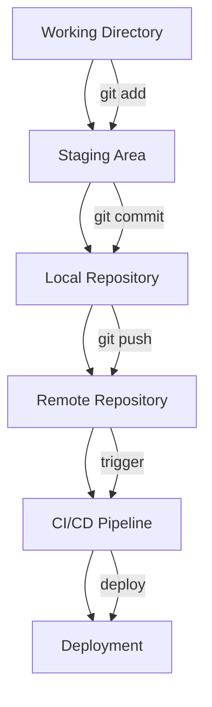
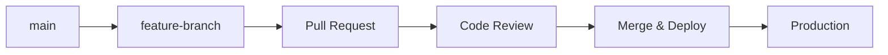
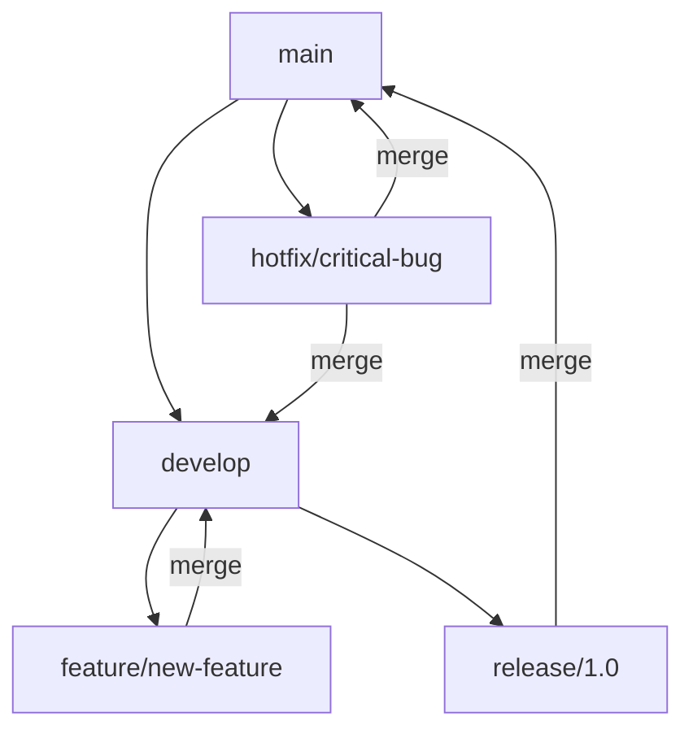
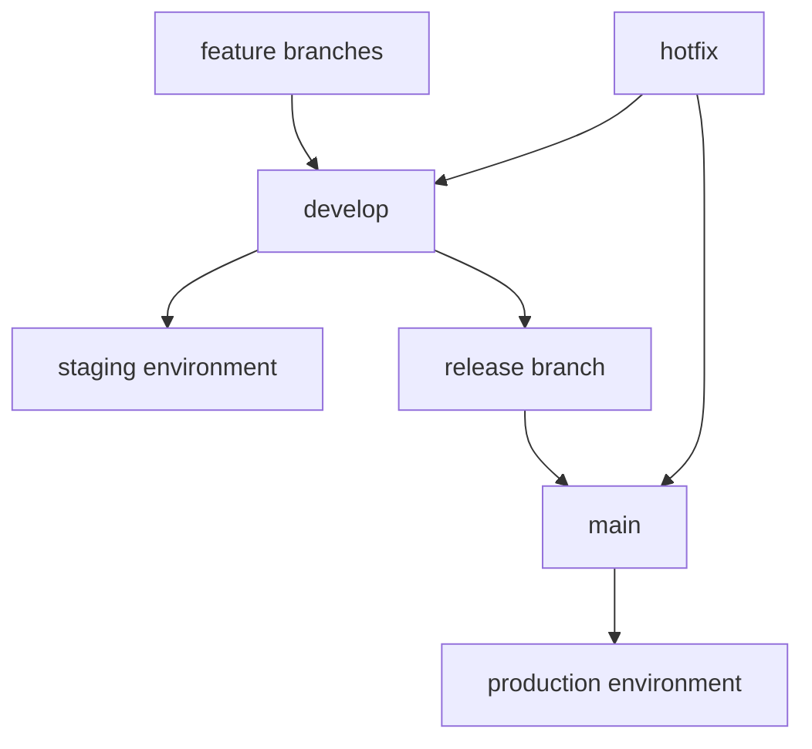

# Git and Git Flow for DevOps

## Table of Contents
1. [Git Essentials for DevOps](#1-git-essentials-for-devops)
2. [Git Workflows](#2-git-workflows)
3. [Git Flow in DevOps](#3-git-flow-in-devops)
4. [DevOps Best Practices](#4-devops-best-practices)
5. [Troubleshooting](#5-troubleshooting)

## 1. Git Essentials for DevOps

### 1.1. Core Git Commands for DevOps

```bash
# Repository operations
git clone <repo-url>
git init

# Daily workflow
git status
git add .
git commit -m "message"
git push origin <branch>
git pull origin <branch>

# Branch management
git checkout -b <branch-name>
git merge <branch-name>
git branch -d <branch-name>

# Remote operations
git remote add origin <url>
git push -u origin main
git fetch origin
```

### 1.2. Git Architecture for DevOps



## 2. Git Workflows

### 2.1. Workflow Comparison for DevOps

| Workflow | Complexity | Team Size | Release Frequency | CI/CD | Best For |
|----------|------------|-----------|-------------------|-------|----------|
| Centralized | Low | 1-3 | Any | Basic | Small projects, learning |
| Feature Branch | Medium | 3-10 | Weekly/Monthly | Good | Most teams |
| Git Flow | High | 5+ | Monthly/Quarterly | Advanced | Scheduled releases |
| GitHub Flow | Low | Any | Daily | Excellent | Continuous deployment |
| GitLab Flow | Medium | 3-15 | Weekly | Excellent | Issue-driven development |

### 2.2. GitHub Flow (Recommended for DevOps)
**Best for:** Continuous deployment, cloud-native applications



#### Implementation:
```bash
# Create feature branch
git checkout -b feature/add-monitoring

# Make changes and commit
git add .
git commit -m "feat: add Prometheus monitoring"
git push origin feature/add-monitoring

# Create PR, review, merge via UI
# Automatic deployment triggers
```

### 2.3. Git Flow (For Scheduled Releases)
**Best for:** Traditional release cycles, complex projects



#### Key Commands:
```bash
# Feature development
git flow feature start monitoring-stack
git flow feature finish monitoring-stack

# Release management
git flow release start 1.0.0
git flow release finish 1.0.0

# Hotfix
git flow hotfix start security-patch
git flow hotfix finish security-patch
```

## 3. Git Flow in DevOps

### 3.1. CI/CD Integration

#### Branch-based Deployment Strategy:
```yaml
# .github/workflows/deploy.yml
name: Deploy

on:
  push:
    branches: [ main, develop ]

jobs:
  deploy-staging:
    if: github.ref == 'refs/heads/develop'
    runs-on: ubuntu-latest
    steps:
      - uses: actions/checkout@v4
      - name: Deploy to staging
        run: ./scripts/deploy-staging.sh

  deploy-production:
    if: github.ref == 'refs/heads/main'
    runs-on: ubuntu-latest
    steps:
      - uses: actions/checkout@v4
      - name: Deploy to production
        run: ./scripts/deploy-production.sh
```

### 3.2. Environment-based Git Flow



#### Environment Mapping:
- **feature branches** → **development environment**
- **develop branch** → **staging environment**  
- **main branch** → **production environment**

### 3.3. DevOps Repository Structure

```bash
/devops-repo
│
├── ci-cd/                    # CI/CD pipelines and templates
│   ├── github/               # GitHub Actions workflows
│   ├── gitlab/               # GitLab CI/CD scripts
│   ├── jenkins/              # Jenkinsfiles or shared libraries
│   └── templates/            # Shared pipeline templates
│
├── infrastructure/          # Infrastructure as Code (IaC)
│   ├── terraform/            # Terraform configurations
│   │   ├── modules/          # Reusable modules
│   │   ├── envs/             # Environment-specific configurations
│   │   │   ├── dev/
│   │   │   ├── staging/
│   │   │   └── prod/
│   └── ansible/              # Ansible playbooks and roles
│
├── environments/            # Logical grouping for different environments
│   ├── dev/
|   │   ├── app-01/ 
|   │   ├── app-02/ 
|   │   └── app-03/
│   ├── staging/
│   └── prod/
│
├── config/                  # Configuration files (YAML, JSON, HCL, etc.)
│   ├── secrets/             # Encrypted or templated secrets (avoid storing plaintext)
│   ├── app-configs/         # App-specific configurations
│   └── vault/               # HashiCorp Vault or secret manager config
│
├── scripts/                 # Automation scripts (Bash, Python, etc.)
│   ├── setup/               # Bootstrap or provisioning scripts
│   ├── cleanup/             # Teardown or GC scripts
│   └── tools/               # Helper scripts
│
├── monitoring/              # Monitoring, logging, and alerting
│   ├── prometheus/          # Prometheus configurations
│   ├── grafana/             # Grafana dashboards
│   └── alertmanager/        # Alertmanager configs
│
├── docker/                  # Dockerfiles and docker-compose setups
│   ├── services/            # Dockerfiles for services/microservices
│   └── base-images/         # Custom base images
│
├── docs/                    # Documentation (Markdown, architecture diagrams, etc.)
│   ├── architecture/
│   └── runbooks/
│
└── README.md                # Overview of the repository
```

### 3.4. Semantic Versioning & Tagging

```bash
# Create release tags
git tag -a v1.0.0 -m "Release version 1.0.0"
git push origin v1.0.0

# Conventional commits for automation
git commit -m "feat: add user authentication"
git commit -m "fix: resolve login issue"
git commit -m "docs: update deployment guide"
```

## 4. DevOps Best Practices

### 4.1. Commit Message Standards

#### Conventional Commits:
```
<type>(<scope>): <subject>

feat(k8s): add monitoring namespace
fix(terraform): resolve VPC CIDR conflict
docs(runbook): update deployment procedure
chore(ci): update workflow dependencies
```

### 4.2. Branch Naming Conventions

```bash
# Feature branches
feature/add-monitoring
feature/implement-autoscaling
feat/JIRA-123-user-auth

# Environment-specific
env/staging/update-configs
env/prod/security-patch

# Infrastructure
infra/upgrade-kubernetes
infra/add-vpc-endpoints

# Hotfixes
hotfix/critical-security-patch
hotfix/database-connection-fix
```

### 4.3. Security Best Practices

```bash
# .gitignore for DevOps repos
*.tfstate
*.tfstate.backup
.terraform/
*.auto.tfvars
secrets.yml
.env.local
kubeconfig
*.pem
*.key

# Signed commits
git config --global commit.gpgsign true
git commit -S -m "feat: add secure deployment"
```

### 4.4. Code Review Process

#### Pull Request Template:
```markdown
## Infrastructure Change Description
Brief description of infrastructure/deployment changes

## Environment Impact
- [ ] Development
- [ ] Staging  
- [ ] Production

## Validation Checklist
- [ ] Terraform plan reviewed
- [ ] Security scan passed
- [ ] Documentation updated
- [ ] Rollback plan documented

## Testing
- [ ] Infrastructure tests pass
- [ ] Deployment tested in staging
- [ ] Monitoring validates changes
```

### 4.5. Multi-Environment Strategy

```bash
# Environment configuration
environments/
├── dev/
│   ├── terraform.tfvars
│   └── .env
├── staging/
│   ├── terraform.tfvars
│   └── .env
└── production/
    ├── terraform.tfvars
    └── .env
```

## 5. Troubleshooting

### 5.1. Common DevOps Git Issues

#### Merge Conflicts in Infrastructure Files:
```bash
# View conflicts
git status

# Resolve Terraform conflicts
git checkout --theirs terraform.tfstate
git add terraform.tfstate

# Resolve and commit
git commit -m "resolve: merge conflict in terraform state"
```

#### Rollback Deployments:
```bash
# Revert last commit
git revert HEAD
git push origin main

# Rollback to specific version
git checkout v1.0.0
git checkout -b hotfix/rollback-v1.0.0
git push origin hotfix/rollback-v1.0.0
```

#### Recovery Strategies:
```bash
# Recover deleted branch
git reflog
git checkout -b recovered-branch <commit-hash>

# Find lost commits
git fsck --lost-found
```

### 5.2. Git Hooks for DevOps Automation

#### Pre-commit Hook:
```bash
#!/bin/sh
# .git/hooks/pre-commit

# Terraform format check
terraform fmt -check=true -diff=true

# Validate Kubernetes manifests
kubectl apply --dry-run=client -f k8s/

# Security scan
trivy fs .

echo "✅ Pre-commit checks passed"
```

### 5.3. Performance Optimization

```bash
# Clean repository
git gc --aggressive

# Optimize for large repos
git config core.preloadindex true
git config core.fscache true
git config gc.auto 256
```

---

## Quick Reference

### Essential DevOps Git Commands:
```bash
# Daily workflow
git pull origin main
git checkout -b feature/new-feature
git add . && git commit -m "feat: description"
git push origin feature/new-feature

# Release management
git tag -a v1.0.0 -m "Release v1.0.0"
git push origin v1.0.0

# Hotfix workflow
git checkout -b hotfix/critical-fix main
git add . && git commit -m "fix: critical issue"
git push origin hotfix/critical-fix
```

### Environment Deployment:
```bash
# Deploy to staging
git push origin develop

# Deploy to production
git checkout main
git merge develop
git push origin main
```

This guide focuses on Git practices essential for DevOps teams, emphasizing automation, infrastructure management, and deployment workflows. 